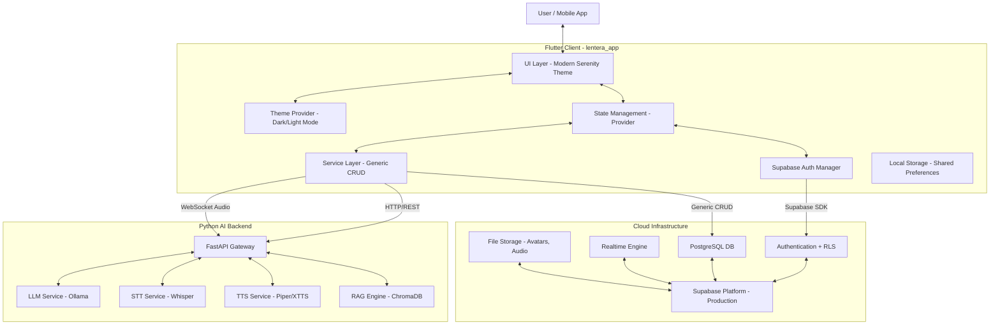

# LENTERA Grand Design Document
> **Version**: 2.0  
> **Date**: 2025-12-15  
> **Status**: UPDATED - Dreamflow Integration Complete  
> **Last Update**: Post-Dreamflow Supabase Replacement

## 1. Executive Summary
LENTERA is a comprehensive AI-powered mental health application designed to provide accessible psychological support through multiple modalities: real-time voice conversations with an AI, text-based counseling, mood tracking, gamification features, and professional consultation booking. 

The system leverages a **hybrid architecture** combining a high-performance **Flutter mobile frontend** with a robust **Python FastAPI backend**, integrated with advanced AI models (Ollama, Whisper, Piper/XTTS) and **Supabase** for real-time capabilities.

**NEW IN V2.0**: Integration with Dreamflow AI's production-ready Supabase implementation, comprehensive theme system with dark mode, gamification layer, and enhanced UI/UX components.

---

## 2. System Architecture

### 2.1 High-Level Architecture
The system follows a client-server model with a specialized AI processing pipeline and production-grade authentication.



### 2.2 Detailed Data Flow (Voice Call)
1. **Audio Capture**: Flutter App records audio chunks via `flutter_sound`/`record`
2. **Streaming**: Chunks sent via WebSocket to Backend
3. **Processing**:
    - **STT**: Whisper converts Audio → Text
    - **RAG**: ChromaDB retrieves relevant context from knowledge base
    - **LLM**: Ollama generates empathetic response text
    - **TTS**: Piper/XTTS converts Text → Audio
4. **Response**: Audio stream sent back to Flutter App via WebSocket
5. **Playback**: Flutter App plays audio chunks in real-time
6. **Storage**: Conversation saved to Supabase with RLS policies

---

## 3. Technology Stack

### Frontend (Mobile - Flutter)
*   **Framework**: Flutter 3.9.0+
*   **Language**: Dart 3.9.0
*   **Architecture**: MVVM (Model-View-ViewModel)
*   **State Management**: Provider
*   **Navigation**: go_router 16.2.0 *(NEW)*
*   **Theme**: Modern Serenity Design System with Dark Mode *(NEW)*
*   **Typography**: Google Fonts (Inter)

**Core Packages**:
```yaml
# Networking & Backend
dio: ^5.4.0                    # HTTP Client
web_socket_channel: ^2.4.0     # Real-time WebSocket
supabase_flutter: ^2.12.0      # Supabase SDK

# Audio
flutter_sound: ^9.30.0         # Audio playback
record: >=5.1.2                # Audio recording (NEW)
permission_handler: ^11.0.1    # Microphone permissions

# UI & UX
google_fonts: ^6.1.0           # Typography
flutter_animate: ^4.5.0        # Animations
table_calendar: ^3.2.0         # Mood calendar
fl_chart: ^0.68.0              # Analytics charts (NEW)
flutter_markdown: ^0.7.7+1     # Rich text (NEW)
image_picker: >=1.1.2          # Avatar upload (NEW)

# State & Storage
provider: ^6.0.5               # State management
shared_preferences: ^2.0.0     # Local storage (NEW)
path_provider: ^2.1.2          # File system access

# Utils
intl: ^0.20.2                  # Internationalization
go_router: ^16.2.0             # Advanced routing (NEW)
```

### Backend (AI & API)
*   **Framework**: FastAPI (Python)
*   **Server**: Uvicorn (ASGI)
*   **AI Engine**:
    -   **LLM**: Ollama (Llama3.2 / Mistral)
    -   **STT**: Faster-Whisper (base/small model)
    -   **TTS**: Piper or XTTS
    -   **Vector DB**: ChromaDB for RAG
*   **Containerization**: Docker & Docker Compose

### Infrastructure & Database
*   **Platform**: Supabase Cloud (PostgreSQL 15, Auth, Storage, Realtime)
*   **Authentication**: Supabase Auth with Email/Password + Email Verification *(ENHANCED)*
*   **Security**: Row Level Security (RLS) Policies *(NEW)*
*   **Storage Buckets**: avatars, mood-audio, profile-images *(NEW)*
*   **Hosting**: 
    - Frontend: Future deploy to App Store/Play Store
    - Backend: VPS/Cloud (Docker containers)
    - Database: Supabase Cloud

---

## 4. Database Schema Design

### 4.1 Enhanced Schema with Dreamflow Integration

```mermaid
erDiagram
    AUTH_USERS ||--|| USERS : references
    USERS ||--o{ MOOD_ENTRIES : tracks
    USERS ||--o{ BOOKINGS : makes
    USERS ||--o{ CONVERSATIONS : participates
    
    PSYCHOLOGISTS ||--o{ BOOKINGS : receives
    
    CONVERSATIONS ||--o{ MESSAGES : contains
    
    AUTH_USERS {
        uuid id PK
        string email
        string encrypted_password
        timestamp email_confirmed_at
        jsonb raw_user_meta_data
    }

    USERS {
        uuid id PK
        string email UNIQUE
        string full_name
        string avatar_url
        timestamp created_at
    }

    MOOD_ENTRIES {
        uuid id PK
        uuid user_id FK
        int mood_rating
        text_array mood_tags
        text journal_text
        text audio_url
        text transcription
        timestamp created_at
    }

    PSYCHOLOGISTS {
        uuid id PK
        string name UNIQUE
        string specialization
        int price_per_session
        boolean is_available
        text photo_url
        text bio
        numeric rating
        timestamp created_at
    }

    BOOKINGS {
        uuid id PK
        uuid user_id FK
        uuid psychologist_id FK
        timestamp start_time
        timestamp end_time
        string platform
        int price
        int admin_fee
        string status
        text notes
        numeric rating
        text review
        timestamp created_at
    }

    CONVERSATIONS {
        uuid id PK
        uuid user_id FK
        string title
        timestamp updated_at
    }

    MESSAGES {
        uuid id PK
        uuid conversation_id FK
        string role
        text content
        timestamp created_at
    }
```

### 4.2 Key Schema Enhancements
- **Users Table**: References `auth.users` with CASCADE delete
- **Mood Tags**: Changed to `text[]` array for better querying
- **Psychologists**: Added `rating`, `bio`, `photo_url` fields
- **Bookings**: Enhanced with `start_time`, `end_time`, `platform`, `admin_fee`, `review` fields
- **Indexes**: Optimized for common queries (user_id, created_at, rating)

---

## 5. API Specification

### 5.1 Supabase Generic CRUD Service *(NEW)*

All database operations now use the generic `SupabaseService`:

```dart
// SELECT with filters
final moods = await SupabaseService.select(
  'mood_entries',
  filters: {'user_id': userId},
  orderBy: 'created_at',
  ascending: false,
  limit: 10,
);

// INSERT
await SupabaseService.insert('mood_entries', data);

// UPDATE
await SupabaseService.update('users', data, filters: {'id': userId});

// DELETE
await SupabaseService.delete('bookings', filters: {'id': bookingId});
```

### 5.2 Authentication API *(ENHANCED)*

**SupabaseAuthManager** provides:
- ✅ `signInWithEmail()` - Email/password login with verification check
- ✅ `createAccountWithEmail()` - Sign up with auto email verification
- ✅ `resendVerificationEmail()` - Resend confirmation email
- ✅ `resetPassword()` - Password reset flow
- ✅ `updateEmail()` - Email change with verification
- ✅ `deleteUser()` - Account deletion
- ✅ `signOut()` - Session termination

### 5.3 REST API (Backend - Future)
Base URL: `/api/v1`

| Method | Endpoint | Description | Auth Required |
| :--- | :--- | :--- | :--- |
| **POST** | `/auth/sync-session` | Sync Supabase session | Yes |
| **GET** | `/psychologists` | List available psychologists | Yes |
| **POST** | `/booking/create` | Create consultation booking | Yes |
| **POST** | `/mood` | Upload mood entry (Audio + JSON) | Yes |
| **GET** | `/mood` | Get mood entries by date range | Yes |
| **GET** | `/trivia/generate` | Generate daily trivia | Yes |
| **POST** | `/trivia/submit` | Submit trivia answer | Yes |
| **GET** | `/gamification/points` | Get user points/level *(NEW)* | Yes |

### 5.4 WebSocket API (Real-time AI)
URL: `wss://api.domain.com/ws/call/{user_id}`

**Client → Server**:
- `audio_chunk`: Binary PCM data
- `interrupt`: JSON `{ "type": "interrupt" }`

**Server → Client**:
- `transcript`: JSON `{ "type": "transcript", "text": "..." }`
- `audio_stream`: Binary Audio data

---

## 6. Project Structure

### 6.1 Updated Monorepo Structure

```
LENTERA/
├── lentera_app/              # Flutter App (Active)
│   ├── lib/
│   │   ├── auth/             # Auth managers (NEW)
│   │   │   ├── auth_manager.dart
│   │   │   └── supabase_auth_manager.dart
│   │   ├── supabase/         # Supabase config (NEW)
│   │   │   ├── supabase_config.dart
│   │   │   ├── supabase_tables.sql
│   │   │   ├── supabase_policies.sql
│   │   │   ├── supabase_sample_data.sql
│   │   │   └── database.types.ts
│   │   ├── core/
│   │   │   ├── constants/
│   │   │   └── services/
│   │   │       ├── api_service.dart
│   │   │       ├── audio_service.dart
│   │   │       └── socket_service.dart
│   │   ├── models/           # Data models
│   │   │   ├── user_model.dart
│   │   │   ├── mood_model.dart
│   │   │   ├── psychologist_model.dart
│   │   │   ├── booking_model.dart
│   │   │   ├── conversation_model.dart
│   │   │   └── message_model.dart
│   │   ├── providers/        # State management
│   │   │   └── chat_provider.dart
│   │   ├── ui/
│   │   │   ├── screens/      # 11 screens
│   │   │   └── widgets/      # Reusable components
│   │   ├── theme.dart        # 21KB theme system (NEW)
│   │   ├── theme_provider.dart # Dark mode toggle (NEW)
│   │   ├── nav.dart          # go_router config (NEW)
│   │   └── main.dart         # App entry
│   └── pubspec.yaml
│
├── server/                   # FastAPI Backend
│   ├── app/
│   │   ├── api/              # Route controllers
│   │   ├── core/             # Config, Security
│   │   ├── models/           # Pydantic models
│   │   └── services/         # Business logic
│   ├── Dockerfile
│   └── requirements.txt
│
├── client_archived/          # Legacy client (archived)
├── dreamflow_source/         # Dreamflow reference code
└── docker-compose.yml
```

---

## 7. New Features & Enhancements

### 7.1 Dreamflow Integration Features *(NEW)*

**1. Production-Ready Authentication**
- Email/password with auto-verification
- Password reset flow
- Email change capability
- Account deletion
- Comprehensive error handling

**2. Modern Theme System**
- **Modern Serenity** color palette (Calming Teal, Dark Slate Blue)
- Full dark mode support with theme toggle
- Custom theme extensions (BrandingColors, AppColors, ChatColors)
- Consistent spacing (xs/sm/md/lg/xl) and border radius constants
- Google Fonts (Inter) typogr aphy with proper hierarchy

**3. Enhanced Navigation**
- go_router for type-safe routing
- Deep linking support
- Route guards for auth

**4. Gamification Layer** *(PLANNED)*
- Points system (mood entry, chat, booking completion)
- User levels & achievements
- Avatar customization
- Daily login streaks

**5. Improved Storage**
- shared_preferences for local settings
- Supabase Storage for avatars, audio files
- Organized bucket structure

**6. Better Charts & Analytics**
- fl_chart for mood visualization
- Historical mood trends
- Insights dashboard

---

## 8. Implementation Roadmap

### Phase 1: Foundation ✅ COMPLETE
- [x] Setup Monorepo & Git
- [x] Configure Supabase Project (Auth, DB Tables, RLS)
- [x] Integrate Dreamflow Supabase implementation
- [x] Create Flutter UI with Modern Serenity Theme
- [x] Setup FastAPI basic structure

### Phase 2: Core Features (In Progress)
- [x] Flutter screens (11/16 complete)
- [x] Models (6 data models)
- [x] Auth flow (login, register, verification)
- [ ] FastAPI AI endpoints
- [ ] WebSocket connection for voice
- [ ] STT/TTS integration
- [ ] LLM pipeline

### Phase 3: AI Integration (Next)
- [ ] Integrate Ollama LLM
- [ ] Implement Whisper STT
- [ ] Implement Piper/XTTS TTS
- [ ] Build Voice Call with streaming
- [ ] RAG with ChromaDB
- [ ] Real-time chat with Supabase

### Phase 4: Business Features (Future)
- [ ] Psychologist booking system
- [ ] Payment gateway integration
- [ ] Video call feature
- [ ] Gamification implementation
- [ ] Mood insights & analytics
- [ ] Daily trivia feature

### Phase 5: Polish & Deploy (Final)
- [ ] UI animations & transitions
- [ ] Error handling & offline mode
- [ ] Performance optimization
- [ ] QA & testing
- [ ] App Store & Play Store deployment

---

## 9. Security & Privacy

### 9.1 Enhanced Security Measures *(NEW)*

**Authentication**:
- JWT tokens via Supabase Auth
- Email verification required
- Secure password reset flow
- Session management with auto-refresh

**Row Level Security (RLS)**:
```sql
-- Users: Only access own profile
CREATE POLICY users_select_own ON users
  FOR SELECT TO authenticated
  USING (auth.uid() = id);

-- Mood Entries: Private to owner
CREATE POLICY mood_entries_owner ON mood_entries
  FOR ALL TO authenticated
  USING (auth.uid() = user_id);

-- Conversations: Owner-only access
CREATE POLICY conversations_owner ON conversations
  FOR ALL TO authenticated
  USING (auth.uid() = user_id);
```

**Data Privacy**:
- Audio recordings transient (processed then discarded unless saved)
- Chat history with RLS protection
- User data isolated per account
- HTTPS/WSS for all communications
- Encrypted storage in Supabase

**Access Control**:
- Column-level permissions
- Cascade delete on user removal
- API authentication required
- Rate limiting (future)

---

## 10. Design System

### 10.1 Modern Serenity Theme

**Color Palette**:
- **Primary**: Calming Teal #2A9D8F
- **Secondary**: Dark Slate Blue #264653
- **Tertiary**: Sandy Gold #E9C46A
- **Background Light**: #F8F9FA
- **Background Dark**: #0F1415

**Typography**:
- Font: Inter (Google Fonts)
- Scale: Material Design 3 type scale
- Spacing: 1.5x for readability

**Spacing System**:
- xs: 4px, sm: 8px, md: 16px, lg: 24px, xl: 32px, xxl: 48px

**Border Radius**:
- sm: 8px, md: 12px, lg: 16px, xl: 24px

---

## 11. Configuration

### 11.1 Environment Variables

See `.env.example` for full configuration. Key variables:

```env
# Supabase
SUPABASE_URL=https://your-project.supabase.co
SUPABASE_ANON_KEY=your-anon-key

# Backend
API_BASE_URL=http://localhost:8000
WEBSOCKET_URL=ws://localhost:8000/ws

# AI Services
OLLAMA_URL=http://localhost:11434
OLLAMA_MODEL=llama3.2:latest
WHISPER_MODEL=base
TTS_ENGINE=piper

# Gamification
POINTS_MOOD_ENTRY=10
POINTS_CHAT_SESSION=20
LEVEL_UP_THRESHOLD=100

# Feature Flags
ENABLE_GAMIFICATION=true
ENABLE_VIDEO_CALL=true
ENABLE_DARK_MODE=true
```

---

## 12. Testing & Quality Assurance

### 12.1 Testing Strategy (Future)

**Unit Tests**:
- Model serialization/deserialization
- Service layer logic
- Utility functions

**Integration Tests**:
- Supabase CRUD operations
- Authentication flows
- WebSocket connections

**Widget Tests**:
- Screen rendering
- User interactions
- State management

**E2E Tests**:
- Complete user journeys
- Payment flows
- Voice call scenarios

---

## Appendix A: Migration from V1.0

**Major Changes**:
1. Replaced basic Supabase with Dreamflow's production implementation
2. Added comprehensive theme system with dark mode
3. Integrated go_router for advanced routing
4. Enhanced database schema with additional fields
5. Implemented RLS policies for security
6. Added 6 new Flutter dependencies
7. Archived legacy `client/` folder

**Breaking Changes**:
- Old `AuthProvider` replaced with `SupabaseAuthManager`
- Custom theme replaced with Modern Serenity theme system
- Manual routes replaced with go_router (planned)

---

## Appendix B: Resources

**Documentation**:
- [Supabase Docs](https://supabase.com/docs)
- [Flutter Docs](https://docs.flutter.dev)
- [FastAPI Docs](https://fastapi.tiangolo.com)
- [Ollama Docs](https://ollama.ai/library)

**Design**:
- [Modern Serenity Theme](lib/theme.dart)
- [Material Design 3](https://m3.material.io)

---

**Document Control**:
- Version 2.0
- Last Updated: December 15, 2025
- Authors: LENTERA Development Team + Dreamflow AI Integration
- Status: Living Document - Updated with Dreamflow Integration
